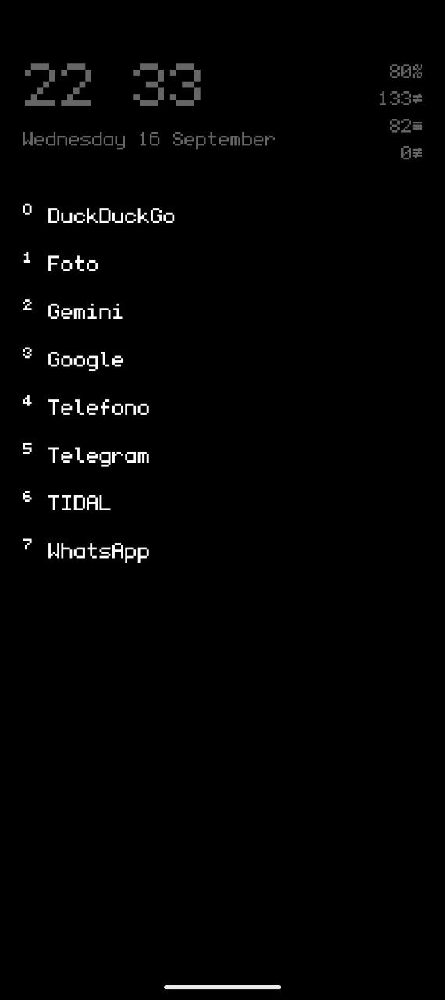
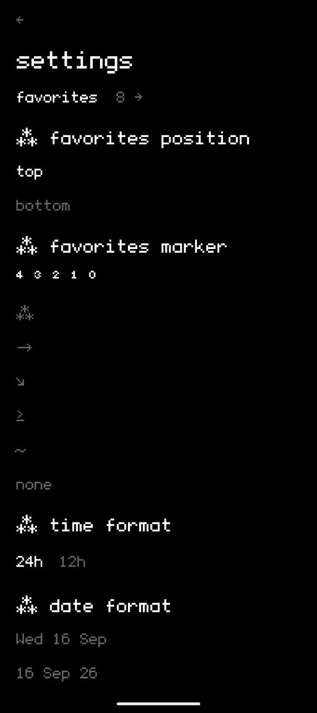

# Minimal Launcher Monospace

A text-only Android launcher: white text on pure black, pixel monospace font, no icons, no wallpaper clutter. Built for a Pixel 10 (Android 16+), works on any device API 26+.

## Features

- **Header** — big clock (configurable separator: `23_45`, `23.45`, `23 45`…), date (4 formats), battery %, usage minutes, daily unlock count, daily notification count. Tap time/date → Clock app; tap usage/unlocks/notifications → Digital Wellbeing.
- **Favorites** — up to 8 favorite apps on the main page, top or bottom position, optional marker prefix (`⁴ ³ ² ¹ ⁰`, `⁂`, `⟶`, `↘`, `≥`, `〜`).
- **App list** — a separate screen reached with a **downward swipe** from the main page; keyboard opens automatically. Upward swipe at the top (or back) returns home. Scrolling the list hides the keyboard; returning to the top brings it back.
- **Search** — live filtering; a query matching exactly one app auto-launches it (no Enter needed). Enter launches the first result.
- **Gestures on the main page** — swipe left → Phone, swipe right → Camera, long-press on empty space → Settings.
- **System integration** — hides the system status bar on the home (swipe from the top edge to peek), applies a pure black wallpaper (home + lock screen) when set as the default launcher, and provides shortcuts to grant usage/notification access.
- **Counters** — usage time uses the same definition as Digital Wellbeing (foreground time only while the screen is on); unlocks come from keyguard events; notifications are counted once per day per notification (updates and system notifications excluded) and reset at midnight.

## Screenshots

| Main page | App list |
|---|---|
|  |  |

## Settings

- favorites → dedicated picker with its own search (max 8)
- favorites position (top / bottom)
- favorites marker (superscripts / ⁂ / ⟶ / ↘ / ≥ / 〜 / none)
- time format (24h / 12h)
- date format (`Sun 13 Sep`, `13 Sep 26`, `Sun 13/09`, `Sunday 13 September`)
- time separator (`:`, `_`, `.`, space, none)
- home info (show unlocks / show notifications)
- set as default launcher
- black wallpaper (re-applies it manually)
- grant usage access / grant notification access (shown when missing)
- about (font credit + license)

## Download

**[Download Minimal Launcher 1.0 (APK)](releases/MinimalLauncher-1.0.apk)** — signed release build, ready to sideload.

> When the repo is on GitHub, you can also attach the APK to a tagged
> [GitHub Release](https://docs.github.com/en/repositories/releasing-projects-on-github/about-releases)
> for a versioned download page.

## Build

Prerequisites: JDK 17, Android SDK (compileSdk 36), Gradle 8.13 (wrapper included).

```bash
./gradlew assembleDebug      # debuggable variant (package suffix .debug)
./gradlew assembleRelease    # signed release (keystore: release.keystore)
```

## Install

```bash
adb install -r app/build/outputs/apk/release/app-release.apk
adb shell cmd package set-home-activity com.riccardopatane.minimallauncher/.MainActivity
```

Revert to the stock launcher:

```bash
adb shell cmd package set-home-activity com.google.android.apps.nexuslauncher/.NexusLauncherActivity
```

## Permissions

- **Usage access** (`PACKAGE_USAGE_STATS`) — usage time and unlock count; granted in Settings → Usage access (the app shows a shortcut).
- **Notification access** (`NotificationListenerService`) — notification count; granted in Settings → Notifications access.
- **Set wallpaper** (`SET_WALLPAPER`) — normal permission, used for the black wallpaper.

## Credits

- Font: [undefined medium](https://github.com/andirueckel/undefined-medium) by Andi Rueckel — SIL Open Font License 1.1 (full license bundled in `assets/OFL.txt`)
- Designed by [riccardo p](https://github.com/imriccardop)
